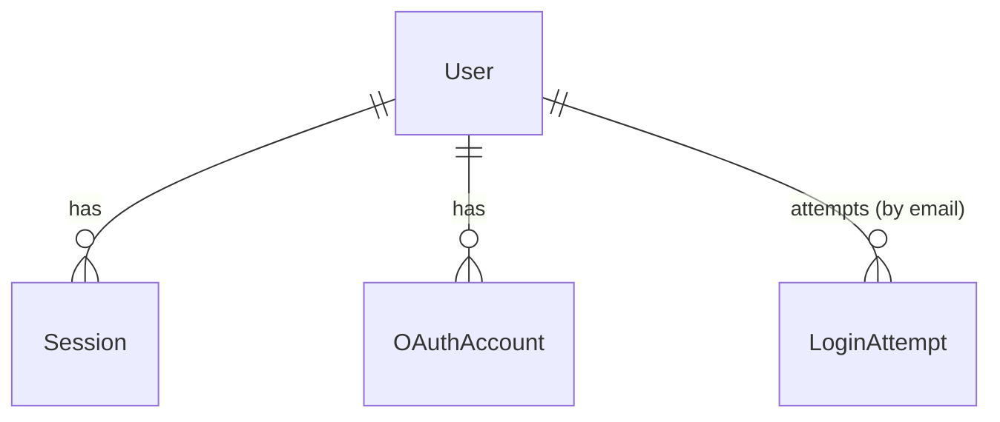

# Domain Entities — Unit 1: Auth & Accounts

## Entity: User

| Field | Type | Notes |
|---|---|---|
| `id` | UUID (PK) | |
| `email` | string, unique | Also the login identifier for the email/password method. |
| `passwordHash` | string, nullable | Null for OAuth-only accounts (Google). Adaptive hashing (per SECURITY-12 — see business-rules.md). |
| `displayName` | string | Added per Question 5: A. Shown on messages the buyer posts; no other public buyer profile in Phase 1. |
| `isAdmin` | boolean, default `false` | Separate flag per Question 1: A — not part of the buyer/seller distinction, not exposed in any Phase 1 UI (no admin UI exists per requirements.md's Phase 1 scope), reserved for future use. |
| `createdAt` | timestamp | |

**Note on "role"**: There is no `role` field distinguishing buyer/seller. Every `User` is implicitly a buyer. Seller capability is derived, not stored: a user "is a seller" exactly when a `ShopProfile` (Unit 2) exists with `ShopProfile.userId == User.id`. This resolves the proposal's role-modeling contradiction (Question 1: A).

## Entity: Session

| Field | Type | Notes |
|---|---|---|
| `id` | UUID (PK) | |
| `userId` | UUID (FK → User) | |
| `expiresAt` | timestamp | |
| `createdAt` | timestamp | |

Database-backed (Question 2: A) — a row here represents a live, revocable session. Deleting the row (on logout, or admin-forced revocation) immediately invalidates it — no reliance on client-side JWT expiry.

## Entity: OAuthAccount

| Field | Type | Notes |
|---|---|---|
| `id` | UUID (PK) | |
| `userId` | UUID (FK → User) | |
| `provider` | enum (`google`) | Only Google in Phase 1 (Question 3: B). Structured as an enum/table (not a boolean flag on User) so Apple can be added in a later phase without a schema rework. |
| `providerAccountId` | string | Provider's stable subject/user ID. |

## Entity: LoginAttempt (supports SECURITY-12 brute-force protection)

| Field | Type | Notes |
|---|---|---|
| `id` | UUID (PK) | |
| `email` | string | The attempted login identifier (tracked even for non-existent accounts, to prevent user enumeration via timing/response differences). |
| `succeeded` | boolean | |
| `attemptedAt` | timestamp | |

Used to compute the progressive delay (Question 4: A) — see business-rules.md for the exact rule.

## Relationships

