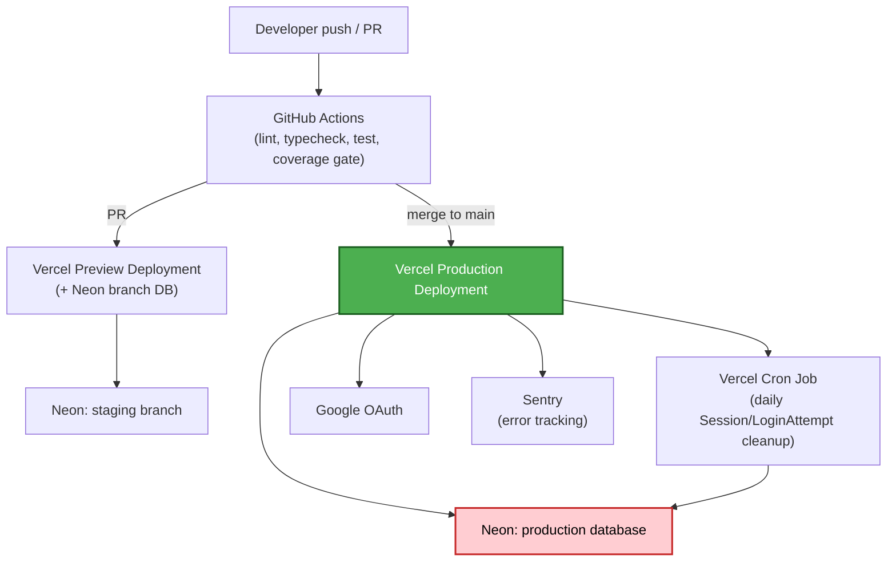

# Deployment Architecture — Unit 1: Auth & Accounts

## Environment Mapping (Question 3: B)

| Environment | Vercel | Database |
|---|---|---|
| Development | Local `next dev` | Local Postgres or a personal Neon branch |
| Staging | Vercel preview deployment (persistent staging alias) | Neon staging branch |
| Production | Vercel production deployment | Neon production database |

## Rollback Path
Per the project-wide rollback decision (NFR Design): a bad production deploy is reverted via Vercel's instant rollback to the previous deployment. Since Unit 1 introduces new tables (User/Session/OAuthAccount/LoginAttempt) but no destructive migrations, a code rollback alone is sufficient — no database-aware rollback procedure is needed for this unit's initial release.
