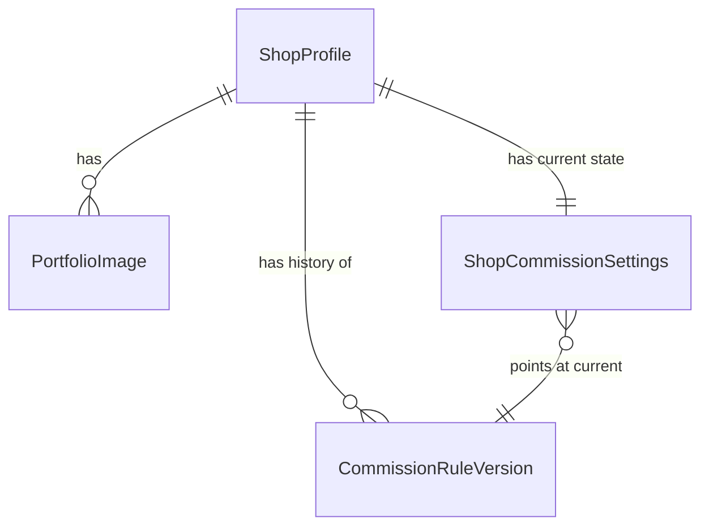

# Domain Entities — Unit 2: Shops & Commission Rules

## Entity: ShopProfile

| Field | Type | Notes |
|---|---|---|
| `id` | UUID (PK) | |
| `userId` | UUID (FK → users, unique) | One-to-one with a user. Existence of this row is what makes a user "a seller" (BR — see business-logic-model.md). |
| `bannerImageUrl` | text, nullable | Object storage URL (provider decided at Infrastructure Design). |
| `avatarImageUrl` | text, nullable | |
| `bio` | text, nullable | |
| `socialLinks` | jsonb | Array of `{ label: string, url: string }`. |
| `createdAt` | timestamp | |

## Entity: PortfolioImage

| Field | Type | Notes |
|---|---|---|
| `id` | UUID (PK) | |
| `shopId` | UUID (FK → ShopProfile) | |
| `imageUrl` | text | |
| `position` | integer | Display order; no hard count limit (Question 4: A). |
| `createdAt` | timestamp | |

## Entity: CommissionRuleVersion (renamed/split from the single "CommissionRuleSet" per the Functional Design refinement below)

Immutable content history — append-only (Question 2: A). A new row is created on every publish; existing rows are **never** updated or deleted.

| Field | Type | Notes |
|---|---|---|
| `id` | UUID (PK) | |
| `shopId` | UUID (FK → ShopProfile) | |
| `version` | integer | Starts at 1; increments per shop on each publish. |
| `tiers` | jsonb | Array of `{ id, name, description, priceCents }`. ≥1 required to publish (Question 3: A). |
| `addOns` | jsonb | Array of `{ id, name, priceDeltaCents }`. |
| `rulesContent` | jsonb | Array of content blocks — see Block Schema below (Question 1: C). |
| `publishedAt` | timestamp | |

## Entity: ShopCommissionSettings (Functional Design refinement — see rationale below)

Mutable operational state, one row per shop — separate from the immutable version history because slot state and queue limit change far more often than rule *content*, and don't need per-change historical rows the way published rule text does.

| Field | Type | Notes |
|---|---|---|
| `shopId` | UUID (PK, FK → ShopProfile) | |
| `currentVersionId` | UUID, nullable (FK → CommissionRuleVersion) | Null until the shop's first publish. |
| `slotState` | text (`'open' \| 'closed' \| 'waitlist'`), default `'closed'` | A new shop starts closed until the seller explicitly opens it. |
| `maxQueue` | integer, nullable | Must be positive when set (Question 3: A); null = no queue limit enforced (Unit 5's SlotManagementService treats null as unbounded). |
| `updatedAt` | timestamp | |

### Refinement Rationale (documented, not silent)
Application Design's `components.md` defined a single `CommissionRuleSet` component owning "versioned rule sets... slot management... max queue." This Functional Design pass splits its *storage* into two tables (content history vs. operational settings) while keeping it one logical component/module (`src/server/shops/rules.ts`) — the component boundary from Application Design is unchanged; this is an internal data-modeling decision appropriate to Functional Design's level of detail.

## Block Schema (`rulesContent`, Question 1: C)

```ts
type ContentBlock =
  | { type: "heading"; text: string }
  | { type: "paragraph"; text: string }
  | { type: "bulletList"; items: string[] }
  | { type: "image"; imageUrl: string; caption?: string };
```

**Scope decision**: no `priceTable` block type, even though the proposal mentions "price tables" among block examples — tiers/add-ons are already structured data rendered as a price table elsewhere on the shop page; a duplicate block-level price table would let the two drift out of sync. Documented here rather than asked as a question, since it directly follows from data already being structured (avoiding redundant sources of truth is not a judgment call requiring user input).

## Relationships


