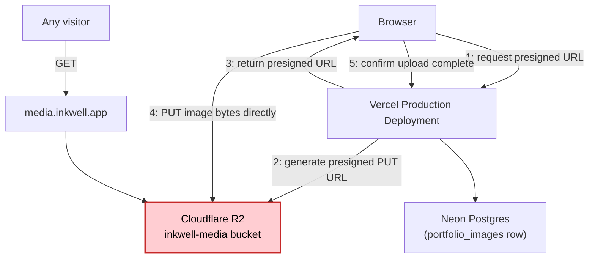

# Deployment Architecture — Unit 2: Shops & Commission Rules

## Environment Mapping
Extends Unit 1's table (aidlc-docs/construction/unit-1-auth/infrastructure-design/deployment-architecture.md) with:

| Environment | R2 Object Key Prefix |
|---|---|
| Development | `dev/` |
| Staging | `staging/` |
| Production | `prod/` |

## Rollback Path
A code rollback (Vercel instant rollback, per Unit 1's decision) does not affect already-uploaded R2 objects or existing Postgres rows — this unit introduces no destructive migrations, so a code-only rollback remains sufficient, consistent with Unit 1.
