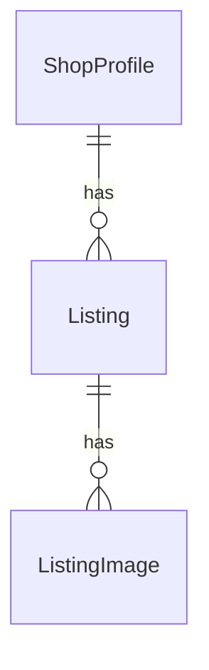

# Domain Entities — Unit 3: Listings

## Entity: Listing

| Field | Type | Notes |
|---|---|---|
| `id` | UUID (PK) | |
| `shopId` | UUID (FK → ShopProfile) | |
| `title` | text | |
| `description` | text, nullable | |
| `priceCents` | integer | Non-negative (Question 3: B) — zero allowed ("free to a good home"). |
| `status` | text (`'available' \| 'sold' \| 'removed'`), default `'available'` | Soft removal (Question 1: A) — a `'removed'` listing stays in the database (e.g., a completed Order in Unit 6 still references it) but is excluded from public browse (Unit 4). |
| `createdAt` | timestamp | |

## Entity: ListingImage

| Field | Type | Notes |
|---|---|---|
| `id` | UUID (PK) | |
| `listingId` | UUID (FK → Listing) | |
| `imageUrl` | text | |
| `position` | integer | Display order; no hard count limit, mirroring Unit 2's PortfolioImage (Question 2: A). |

## Relationships

