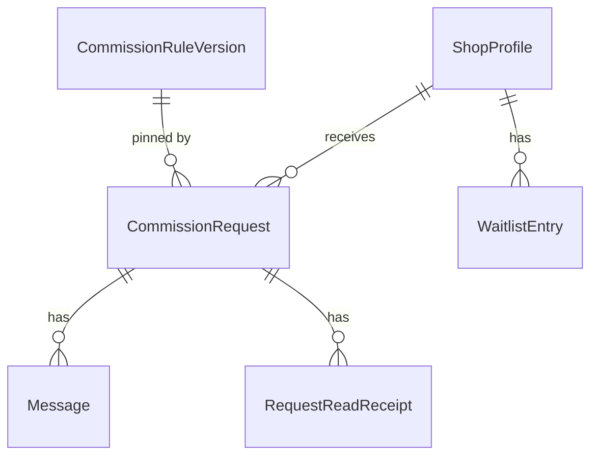

# Domain Entities — Unit 5: Commission Requests & Messaging

## Entity: CommissionRequest

| Field | Type | Notes |
|---|---|---|
| `id` | UUID (PK) | |
| `shopId` | UUID (FK → ShopProfile) | |
| `buyerId` | UUID (FK → User) | |
| `ruleVersionId` | UUID (FK → CommissionRuleVersion) | **Pinned at submission time** — the exact rule version in effect when the buyer submitted, so it never changes even if the shop republishes later (requirements.md's versioning promise). |
| `tierId` | text | References a tier `id` within the pinned `ruleVersionId`'s `tiers` array (tiers are jsonb, not a separate table — no FK possible, validated at submission time instead). |
| `addOnIds` | jsonb (`string[]`) | Same non-FK-able reference as `tierId`, for the same reason. |
| `description` | text | |
| `referenceImageUrls` | jsonb (`string[]`) | Simple URL array (no ordering/position needed for reference material, unlike portfolio/listing images) — reuses Unit 2's presigned-upload flow for the actual upload. |
| `budgetCents` | integer, nullable | Buyer's stated budget; optional. |
| `deadlinePreference` | text, nullable | Freeform for Phase 1 (no date-picker validation). |
| `status` | text (`'requested' \| 'accepted' \| 'declined'`), default `'requested'` | Fulfillment states (`in_progress`/`delivered`/etc.) belong to Unit 6's `Order`, not here — see business-logic-model.md's forward-dependency note. |
| `declineReason` | text, nullable | Required when `status = 'declined'` (Question 4: A) — enforced at the business-rule level, not a DB constraint (simpler than a conditional check constraint for Phase 1). |
| `createdAt` | timestamp | |
| `respondedAt` | timestamp, nullable | Set when accepted or declined. |

## Entity: WaitlistEntry

| Field | Type | Notes |
|---|---|---|
| `id` | UUID (PK) | |
| `shopId` | UUID (FK → ShopProfile) | |
| `buyerId` | UUID (FK → User) | |
| `joinedAt` | timestamp | |

Unique constraint on `(shopId, buyerId)` — enforces Question 1: A (idempotent join) at the database level, not just in application logic.

## Entity: Message

Embedded messaging (Application Design Question 2: embedded, not standalone) — but still its own table, since a request has many messages.

| Field | Type | Notes |
|---|---|---|
| `id` | UUID (PK) | |
| `requestId` | UUID (FK → CommissionRequest) | **Always** references CommissionRequest, even after Unit 6 creates an Order from it — Order will look up messages via its own `requestId` reference to the same CommissionRequest, rather than Message needing to know about Order at all. This is what lets Unit 5 ship without depending on Unit 6. |
| `senderId` | UUID (FK → User) | Either the request's `buyerId` or the shop's owner. |
| `body` | text | |
| `attachmentUrls` | jsonb (`string[]`) | |
| `createdAt` | timestamp | |

## Entity: RequestReadReceipt (StatusBadge's backing table)

| Field | Type | Notes |
|---|---|---|
| `requestId` | UUID (PK part, FK → CommissionRequest) | |
| `userId` | UUID (PK part, FK → User) | Composite PK `(requestId, userId)` — one row per user per request. |
| `lastReadAt` | timestamp | |

"Unread" (Question 3: A, simple boolean) is computed, not stored: a request is unread for a user if `lastReadAt` is null or older than the request's latest activity (`max(message.createdAt)` or `respondedAt`).

## Relationships

