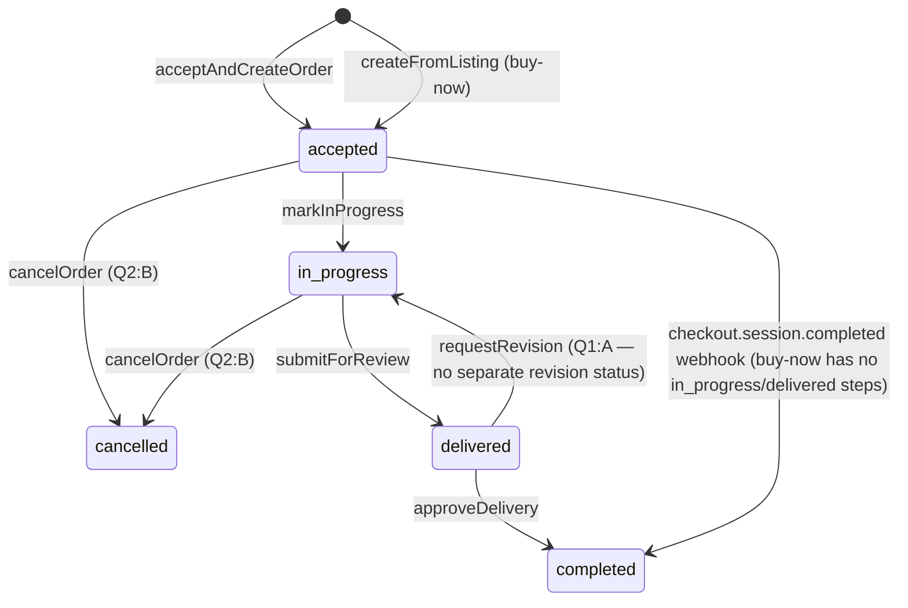

# Business Logic Model — Unit 6: Orders & Payments

## Resolving Unit 5's Forward Dependency
`CommissionLifecycleService.acceptAndCreateOrder(requestId, callerId)` is the new orchestration entry point that supersedes calling Unit 5's `acceptRequest` directly:
1. Calls Unit 5's `acceptRequest(requestId, callerId)` (existing, unmodified) — transitions `CommissionRequest.status` to `'accepted'`.
2. Reads the request's `ruleVersionId`/`tierId`/`addOnIds` to compute `subtotalCents` (tier price + sum of add-on price deltas).
3. Computes fees (`computeFees`, see business-rules.md).
4. Creates an `Order` with `status = 'accepted'`.
5. Calls `Payment.authorizeEscrow` — creates a Stripe Checkout Session (manual capture) and returns its URL for the buyer to complete payment.
- **Cross-unit integration**: Unit 5's `RequestActions.tsx` (Accept button) is modified to call this new function instead of Unit 5's bare `acceptRequestAction`.

## Order Status State Machine

- **Buy-now orders** (`CheckoutService.checkout`) pass through `accepted` only briefly (while the buyer completes Stripe Checkout) and skip `in_progress`/`delivered` entirely — there's no fulfillment pipeline for already-finished work being purchased outright.
- **Cancellation** (Question 2: B) is only allowed from `accepted` or `in_progress` — once `delivered`, the seller has done the work, so cancellation is no longer offered (a buyer who's unhappy at that point uses `requestRevision` instead).

## Payment Module (`src/server/orders/payment.ts`)

### computeFees(subtotalCents, commissionRatePercent = 10)
Pure function — `platformFeeCents = round(subtotalCents * commissionRatePercent / 100)`, `sellerNetCents = subtotalCents - platformFeeCents`. See business-rules.md's PBT-01 table.

### onboardSeller(shopId, callerId)
Owner-only. Creates a Stripe Connect Express account (if `stripeConnectAccountId` is null) and returns an onboarding link URL. Precondition for accepting commissions or listing buy-now items (BR-2).

### createCheckoutSession(order, captureMethod)
Uses **Stripe Checkout** (Stripe-hosted payment page), not a custom Stripe Elements card form — simpler to implement correctly for Phase 1, and still satisfies requirements.md's "no raw card data touches the app" (Stripe hosts the entire payment page; the app never sees card details either way). Creates a Checkout Session with `payment_intent_data.capture_method` set to `'manual'` (escrow) or `'automatic'` (buy-now), idempotency key = `{order.id}-checkout`. Returns the session URL for the buyer's browser to redirect to. `stripePaymentIntentId` is stored once the session's underlying PaymentIntent is known (from the session object or the `checkout.session.completed` webhook).

### authorizeEscrow(order)
Calls `createCheckoutSession(order, 'manual')` — commission path.

### captureDirect(order)
Calls `createCheckoutSession(order, 'automatic')` — buy-now path.

### captureAndRelease(order)
Captures the previously-authorized PaymentIntent (commission path, on `approveDelivery`), then creates a Stripe Connect transfer to the seller's connected account for `sellerNetCents`. **Both the direct API response and the webhook update the Order** — see the Reconciliation note below; this isn't a security gap, it's defense in depth.

### cancelOrder(order)
Cancels (voids) the PaymentIntent authorization via Stripe (releases the hold, no capture ever occurs — Question 2: B, this is a cancellation, not a refund of already-captured funds).

## Reconciliation: Order State Is Only Ever Finalized by a Server-to-Server Signal
requirements.md NFR-4 says payment state must never update from "client-side confirmation alone" — meaning never trust the browser's own claim of success (e.g., a buyer's browser simply returning from the Stripe Checkout redirect is **not** treated as proof of payment).
1. **Checkout Session flow** (initial escrow authorization / buy-now capture): entirely redirect + webhook — the browser returning to the `success_url` only shows an optimistic "processing" state; the Order only actually flips status once `WebhookHandlerService` receives and verifies `checkout.session.completed`/`payment_intent.succeeded`.
2. **Direct API calls** (`approveDelivery` → `captureAndRelease` capturing an already-authorized PaymentIntent; `cancelOrder` → voiding one): these ARE synchronous server-to-server Stripe API calls initiated by our own backend (never the browser), so their direct response is also authoritative — **and** the corresponding webhook event independently confirms/re-applies the same final state as a reconciliation safety net, in case the server crashed after calling Stripe but before writing to the database.
Both paths are idempotent (checking current status before transitioning, and `ProcessedWebhookEvent` dedup for the webhook path) — applying the same confirmation twice is harmless.

## CheckoutService.checkout(listingId, buyerId)
1. Validate the listing is `'available'` (Unit 3's status field).
2. Compute fees from `listing.priceCents`.
3. Create `Order` (no `requestId`, `listingId` set), initial `status = 'accepted'` until payment confirms.
4. `captureDirect` → returns a Checkout Session URL; caller (Server Action) redirects the buyer's browser there.
5. On `checkout.session.completed` (webhook-confirmed), mark the listing `'sold'` (Unit 3's `setListingStatus`, reused) and the Order `'completed'`.

## WebhookHandlerService.handleStripeWebhook(rawPayload, signatureHeader)
1. Verify the Stripe signature (SECURITY rules on webhook trust).
2. Check `ProcessedWebhookEvent` for the event's id — if already processed, return early (idempotent).
3. Dispatch on `event.type`: `checkout.session.completed` → link the session's PaymentIntent id to the Order, and for the buy-now/automatic-capture path, confirm completion; `payment_intent.succeeded` → confirm capture (used for the escrow path's `captureAndRelease` confirmation); `transfer.created` → record `stripeTransferId`; other event types are acknowledged but not acted on (Phase 1 doesn't need the full Stripe event catalog).
4. Record the event id in `ProcessedWebhookEvent`.

## Read Paths
- `getOrder(orderId, callerId)` — object-level auth: only the order's buyer or seller may view it.
- `getOrderHistory(userId)` — all orders where the user is buyer or seller.
