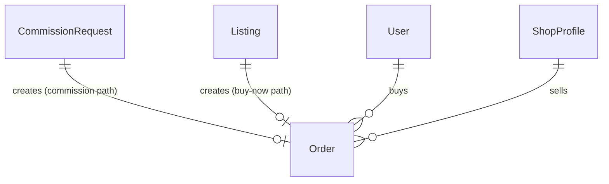

# Domain Entities — Unit 6: Orders & Payments

## Entity: Order

Single table for both fulfillment state and payment fields (design decision, not asked — see plan).

| Field | Type | Notes |
|---|---|---|
| `id` | UUID (PK) | |
| `requestId` | UUID, nullable (FK → CommissionRequest) | Set for commission-derived orders. Exactly one of `requestId`/`listingId` is set, never both/neither (BR-1). |
| `listingId` | UUID, nullable (FK → Listing) | Set for direct "buy now" orders. |
| `buyerId` | UUID (FK → User) | |
| `sellerId` | UUID (FK → User) | Denormalized from the shop owner, for query convenience (avoids a join on every order read). |
| `subtotalCents` | integer | Tier + add-ons total (commission) or listing price (buy-now). |
| `platformFeeCents` | integer | `computeFees` output — see business-rules.md. |
| `sellerNetCents` | integer | `subtotalCents - platformFeeCents`. |
| `status` | text (`'accepted' \| 'in_progress' \| 'delivered' \| 'completed' \| 'cancelled'`) | See business-logic-model.md for the full state machine, including why buy-now orders skip straight to `'completed'`. |
| `stripePaymentIntentId` | text, nullable | |
| `stripeTransferId` | text, nullable | Set once the seller payout transfer is created. |
| `createdAt` | timestamp | |
| `updatedAt` | timestamp | |

## Entity: ProcessedWebhookEvent

| Field | Type | Notes |
|---|---|---|
| `stripeEventId` | text (PK) | Stripe's own event ID — the idempotency mechanism for webhook processing (requirements.md NFR-4). |
| `processedAt` | timestamp | |

## Schema Addition: `ShopProfile.stripeConnectAccountId` (modifies Unit 2's table)

| Field | Type | Notes |
|---|---|---|
| `stripeConnectAccountId` | text, nullable | Set once a seller completes Stripe Connect Express onboarding (S-22). Null means the seller cannot yet receive payouts — enforced as a precondition before a shop can accept commission acceptances or list buy-now items (BR-2). |

## Relationships

