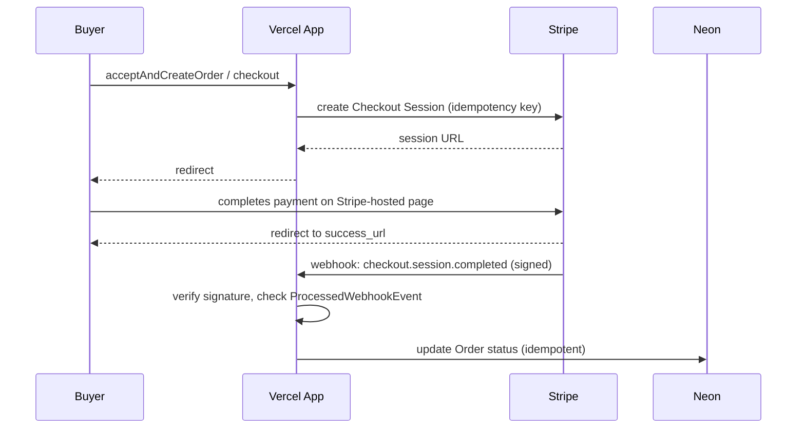

# Deployment Architecture — Unit 6: Orders & Payments

## Environment Mapping
Extends prior units' table with: `STRIPE_SECRET_KEY` and `STRIPE_WEBHOOK_SECRET` per environment (dev/staging/prod), each pointing at Stripe **test mode** keys for dev/staging and **live mode** keys only for production.

## Rollback Path
Code-only rollback (Vercel instant rollback) remains sufficient for application code. **Caveat**: unlike prior units, an in-flight Stripe Checkout Session or an already-captured payment is external state that a code rollback does not undo — this is expected (Stripe transactions aren't meant to be "rolled back" by redeploying the app) and is why idempotency (BR-5) and webhook reconciliation (business-logic-model.md) matter more here than in any prior unit.
