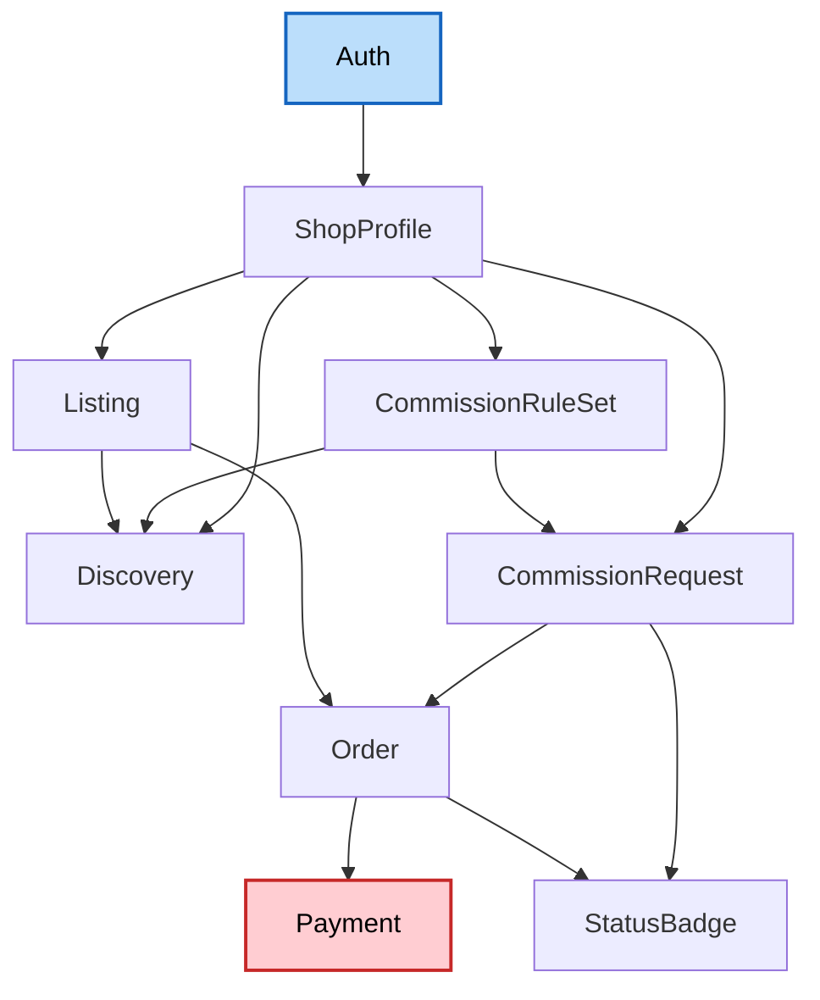

# Application Design — Inkwell (Phase 1)

**Consolidated document** — see individual files for full detail: [components.md](components.md), [component-methods.md](component-methods.md), [services.md](services.md), [component-dependency.md](component-dependency.md).

## Design Decisions (from application-design-plan.md)

1. **Order vs. CommissionRequest**: Kept as two distinct components. `CommissionRequest` owns the pre-payment negotiation (`Requested`/`Accepted`/`Declined`); `Order` owns the paid/fulfillment lifecycle (`In Progress`/`Revision`/`Delivered`/`Completed`) for both commission-derived and direct "buy now" orders.
2. **Messaging**: Embedded inside `CommissionRequest` (and carried into `Order` for the same thread post-acceptance) rather than built as a standalone component — simplest choice for Phase 1's single-thread-per-request/order model.
3. **Notifications**: Requirements.md defers full notifications (email + in-app) to Phase 2. A minimal in-app status badge was added as **FR-8** during this stage (see `application-design-clarification-questions.md`) — an unread/status-change indicator only, no email, no preferences.

## Components (summary — see components.md)

| Component | Responsibility |
|---|---|
| Auth | Accounts, sessions, roles (via Auth.js) |
| ShopProfile | Seller shop pages and portfolio |
| CommissionRuleSet | Versioned commission rules, tiers, add-ons, slot/queue state |
| Listing | Finished-work "buy now" listings |
| Discovery | Browse/search/filter (read-only across Shop/Rules/Listing) |
| CommissionRequest | Pre-payment negotiation + embedded messaging |
| Order | Paid transaction + post-acceptance fulfillment lifecycle |
| Payment | All Stripe Connect logic, isolated per SECURITY-11 |
| StatusBadge | FR-8 lightweight unread/status indicator |

## Services (summary — see services.md)

| Service | Orchestrates |
|---|---|
| CommissionLifecycleService | CommissionRequest → Order → Payment (accept → escrow → deliver → capture) |
| CheckoutService | Listing → Order → Payment (direct purchase, no escrow) |
| SlotManagementService | CommissionRuleSet queue limit vs. active CommissionRequest/Order count |
| WebhookHandlerService | Stripe webhook → Payment (sole path for payment state truth) |
| StatusBadgeSyncService | CommissionRequest/Order status changes → StatusBadge (one-way) |

## Dependency Overview (summary — see component-dependency.md)

*(Payment highlighted as the highest-risk component — real money movement, isolated per SECURITY-11.)*

## Validation Against Requirements

All of FR-1 through FR-8 map to at least one component above:
- FR-1 (Auth) → Auth
- FR-2 (Shops) → ShopProfile, CommissionRuleSet
- FR-3 (Browse) → Discovery
- FR-4 (Requests) → CommissionRequest
- FR-5 (Listings) → Listing
- FR-6 (Payments) → Payment, CommissionLifecycleService, CheckoutService, WebhookHandlerService
- FR-7 (Trust signals subset) → ShopProfile (response-time/completion-rate stats derived from Order data)
- FR-8 (Status badge) → StatusBadge, StatusBadgeSyncService

No component/service exists without a traceable FR, and no FR lacks an owning component — design is complete and consistent for Phase 1 scope.
