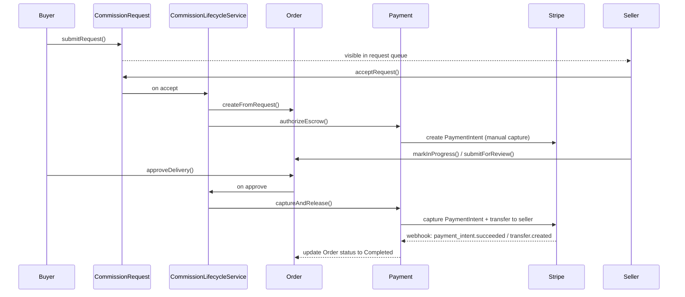
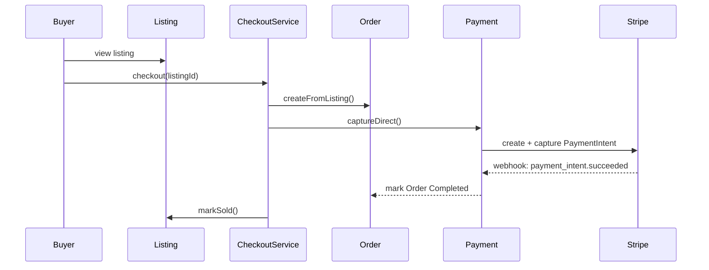

# Component Dependency — Inkwell (Phase 1)

## Dependency Matrix

| Component | Depends On | Communication Pattern |
|---|---|---|
| Auth | — (foundational) | N/A |
| ShopProfile | Auth (owner identity) | Server Action calls `Auth.getSession` for ownership checks |
| CommissionRuleSet | ShopProfile | Direct in-process call; reads shop ownership |
| Listing | ShopProfile | Direct in-process call |
| Discovery | ShopProfile, CommissionRuleSet, Listing | Read-only queries across all three (no write dependency) |
| CommissionRequest | ShopProfile, CommissionRuleSet | Validates submission against the shop's currently published rule set |
| Order | CommissionRequest, Listing | Created via `CommissionLifecycleService`/`CheckoutService`, not directly by the buyer-facing route |
| Payment | Order | Reads/writes Order payment state only via `WebhookHandlerService` (inbound) or explicit Order-triggered calls (outbound authorize/capture) |
| StatusBadge | CommissionRequest, Order | Read-only subscriber via `StatusBadgeSyncService` |
| CommissionLifecycleService | CommissionRequest, Order, Payment | Orchestration layer |
| CheckoutService | Listing, Order, Payment | Orchestration layer |
| SlotManagementService | CommissionRuleSet, CommissionRequest, Order | Orchestration layer |
| WebhookHandlerService | Payment | Orchestration layer (inbound Stripe webhook entry point) |
| StatusBadgeSyncService | CommissionRequest, Order, StatusBadge | Orchestration layer |

## Data Flow — Commission Request to Completion

## Data Flow — Direct "Buy Now" Purchase

## Communication Pattern Notes

- All component-to-component calls are **in-process function calls** (Server Actions/Route Handlers within the single Next.js codebase) — there is no network hop between components, consistent with the single-codebase architecture decision in requirements.md.
- The **only externally-triggered state change path for payments** is the Stripe webhook → `WebhookHandlerService` → `Payment.handleWebhookEvent` → `Order` update. No route ever marks an Order as paid/completed directly from a client request (NFR-4 / SECURITY rules on webhook trust).
- `StatusBadgeSyncService` is a one-way read subscriber — it never writes back to `CommissionRequest` or `Order`, keeping FR-8 fully decoupled from the core lifecycle.
