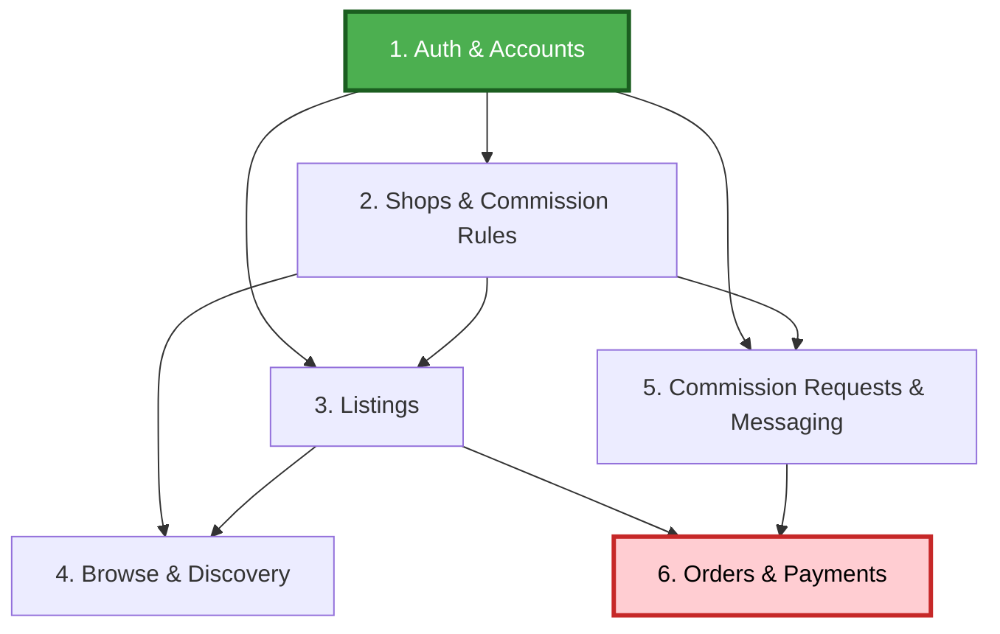

# Unit of Work Dependency — Inkwell (Phase 1)

## Dependency Matrix

| Unit | Depends On | Change Priority |
|---|---|---|
| 1. Auth & Accounts | — | Critical (blocks all other units) |
| 2. Shops & Commission Rules | Unit 1 | Critical |
| 3. Listings | Unit 1, Unit 2 | Important |
| 4. Browse & Discovery | Unit 2, Unit 3 | Important |
| 5. Commission Requests & Messaging | Unit 1, Unit 2 | Critical |
| 6. Orders & Payments | Unit 3, Unit 5 | Critical (highest risk — real money) |

## Dependency Diagram

## Update/Build Strategy

- **Update Approach**: Sequential (single implementer/session per Question 4 — no parallelization planned for this pass).
- **Critical Path**: Unit 1 → Unit 2 → Unit 5 → Unit 6 (the commission-request-to-payment path is the critical path; Units 3 and 4 branch off Unit 2 but don't block Unit 5/6).
- **Coordination Points**: Unit 6 (Orders & Payments) is the sole consumer of both Unit 3 (Listing, for direct purchases) and Unit 5 (CommissionRequest, for commission-derived orders) — it cannot start until both are complete.
- **Testing Checkpoints**: Each unit's Build and Test activities (within its Code Generation stage) validate that unit in isolation; a final integration pass happens in the overall Build and Test phase after Unit 6 completes, per requirements.md NFR-3's integration/E2E layers.
