# Execution Plan — Inkwell (Phase 1)

## Detailed Analysis Summary

### Transformation Scope (Brownfield)
- **Transformation Type**: Architectural — the existing `shareart-frontend` (static single-artist portfolio) is being replaced by a multi-tenant marketplace application with auth, a real data model, and payments. `shareart-backend` is retired (per requirements.md architecture decision: single Next.js codebase).
- **Primary Changes**: Every existing page (`/`, `/gallery`, `/contact`, `/design`) is superseded by new marketplace flows. The existing components (`Navbar`, `IntroAnimation`, `CatEyes`) are not reused — new navigation and shop/browse UI replace them.
- **Related Components**: None reusable from the existing codebase's application logic; only the general tooling (Next.js/Tailwind/ESLint/Prettier config) carries forward as a starting point.

### Change Impact Assessment
- **User-facing changes**: Yes — entirely new UI/UX (shop pages, commission rule editor, browse/gallery, request forms, checkout, messaging, order tracking).
- **Structural changes**: Yes — introduces a real backend (Server Actions/Route Handlers), a database, and third-party integrations (Auth.js, Stripe Connect) where none existed.
- **Data model changes**: Yes — net-new data model (User, ShopProfile, CommissionRuleSet, Listing, CommissionRequest, Order, Message, Review, Payout per requirements.md/proposal §4.3).
- **API changes**: Yes — net-new API surface (Route Handlers/Server Actions for shops, listings, requests, checkout, Stripe webhooks).
- **NFR impact**: Yes — Security Baseline, Resiliency Baseline, and Property-Based Testing are all enabled and enforced from here through Code Generation.

### Component Relationships
- **Primary Component**: `shareart-frontend` (sole application repo going forward).
- **Infrastructure Components**: None yet (to be defined in Infrastructure Design) — hosting, managed Postgres, object storage/CDN, background job runner.
- **Shared Components**: None yet — single codebase, no shared/models package split planned for Phase 1's scale.
- **Dependent Components**: `shareart-backend` — being retired, no ongoing dependency.
- **Supporting Components**: Stripe Connect (external), Auth.js (library, not a separate service).

### Risk Assessment
- **Risk Level**: **High** — real money movement (Stripe Connect escrow), multi-tenant RBAC, and a full replacement of the existing repo, combined with three enforced rule extensions.
- **Rollback Complexity**: Moderate — this is a full rewrite rather than an incremental patch to a live production system (the existing site had no backend/data to migrate), but the payment integration itself has real-money implications that raise the bar on care during Construction.
- **Testing Complexity**: Complex — per requirements.md NFR-3's five-layer test strategy (unit/component/integration/E2E/payments) plus Property-Based Testing enforcement.

## Workflow Visualization

```mermaid
flowchart TD
    Start(["User Request"])

    subgraph INCEPTION["INCEPTION PHASE"]
        WD["Workspace Detection<br/>COMPLETED"]
        RE["Reverse Engineering<br/>COMPLETED"]
        RA["Requirements Analysis<br/>COMPLETED"]
        US["User Stories<br/>COMPLETED"]
        WP["Workflow Planning<br/>IN PROGRESS"]
        AD["Application Design<br/>EXECUTE"]
        UG["Units Generation<br/>EXECUTE"]
    end

    subgraph CONSTRUCTION["CONSTRUCTION PHASE"]
        FD["Functional Design (per unit)<br/>EXECUTE"]
        NFRA["NFR Requirements (per unit)<br/>EXECUTE"]
        NFRD["NFR Design (per unit)<br/>EXECUTE"]
        ID["Infrastructure Design (per unit)<br/>EXECUTE"]
        CG["Code Generation (per unit)<br/>EXECUTE"]
        BT["Build and Test<br/>EXECUTE"]
    end

    subgraph OPERATIONS["OPERATIONS PHASE"]
        OPS["Operations<br/>PLACEHOLDER"]
    end

    Start --> WD
    WD --> RE
    RE --> RA
    RA --> US
    US --> WP
    WP --> AD
    AD --> UG
    UG --> FD
    FD --> NFRA
    NFRA --> NFRD
    NFRD --> ID
    ID --> CG
    CG -->|Next Unit| FD
    CG --> BT
    BT -.-> OPS
    BT --> End(["Complete"])

    style WD fill:#4CAF50,stroke:#1B5E20,stroke-width:3px,color:#fff
    style RE fill:#4CAF50,stroke:#1B5E20,stroke-width:3px,color:#fff
    style RA fill:#4CAF50,stroke:#1B5E20,stroke-width:3px,color:#fff
    style US fill:#4CAF50,stroke:#1B5E20,stroke-width:3px,color:#fff
    style WP fill:#4CAF50,stroke:#1B5E20,stroke-width:3px,color:#fff
    style AD fill:#FFA726,stroke:#E65100,stroke-width:3px,stroke-dasharray: 5 5,color:#000
    style UG fill:#FFA726,stroke:#E65100,stroke-width:3px,stroke-dasharray: 5 5,color:#000
    style FD fill:#FFA726,stroke:#E65100,stroke-width:3px,stroke-dasharray: 5 5,color:#000
    style NFRA fill:#FFA726,stroke:#E65100,stroke-width:3px,stroke-dasharray: 5 5,color:#000
    style NFRD fill:#FFA726,stroke:#E65100,stroke-width:3px,stroke-dasharray: 5 5,color:#000
    style ID fill:#FFA726,stroke:#E65100,stroke-width:3px,stroke-dasharray: 5 5,color:#000
    style CG fill:#4CAF50,stroke:#1B5E20,stroke-width:3px,color:#fff
    style BT fill:#4CAF50,stroke:#1B5E20,stroke-width:3px,color:#fff
    style OPS fill:#BDBDBD,stroke:#424242,stroke-width:2px,stroke-dasharray: 5 5,color:#000
    style Start fill:#CE93D8,stroke:#6A1B9A,stroke-width:3px,color:#000
    style End fill:#CE93D8,stroke:#6A1B9A,stroke-width:3px,color:#000
    style INCEPTION fill:#BBDEFB,stroke:#1565C0,stroke-width:3px,color:#000
    style CONSTRUCTION fill:#C8E6C9,stroke:#2E7D32,stroke-width:3px,color:#000
    style OPERATIONS fill:#FFF59D,stroke:#F57F17,stroke-width:3px,color:#000

    linkStyle default stroke:#333,stroke-width:2px
```

## Phases to Execute

### 🔵 INCEPTION PHASE
- [x] Workspace Detection (COMPLETED)
- [x] Reverse Engineering (COMPLETED)
- [x] Requirements Analysis (COMPLETED)
- [x] User Stories (COMPLETED)
- [x] Workflow Planning (IN PROGRESS — this document)
- [ ] Application Design — **EXECUTE**
  - **Rationale**: New components/services throughout (auth, shop management, commission rules engine, listings, request pipeline, payments/webhooks) with real dependencies between them (e.g., request pipeline depends on shop rules; payments depend on both requests and listings) — service-layer design and component boundaries need to be established before decomposing into units.
- [ ] Units Generation — **EXECUTE**
  - **Rationale**: The system decomposes naturally into several units of work (see below) — a single-pass code generation across the whole marketplace would be unwieldy and risks losing the per-unit design/NFR/infra rigor the enabled extensions require.

### 🟢 CONSTRUCTION PHASE (per unit, once units are defined)
- [ ] Functional Design — **EXECUTE**
  - **Rationale**: New data models (CommissionRuleSet, CommissionRequest, Order, etc.) and complex business logic (rule versioning, status pipeline, escrow timing, fee calculation) need detailed design before code generation, and Property-Based Testing (PBT-01) requires property identification during Functional Design.
- [ ] NFR Requirements — **EXECUTE**
  - **Rationale**: Security Baseline, Resiliency Baseline, and PBT are all enabled — each unit needs an explicit NFR assessment against these rule sets, and PBT-09 (framework selection) is anchored at this stage.
- [ ] NFR Design — **EXECUTE**
  - **Rationale**: Follows directly from NFR Requirements executing; resiliency and security patterns (RBAC enforcement points, timeouts/circuit breaking, backup configuration) need to be incorporated into each unit's design.
- [ ] Infrastructure Design — **EXECUTE**
  - **Rationale**: Hosting, managed Postgres, object storage/CDN, and Stripe webhook infrastructure all need to be mapped concretely; Resiliency Baseline's remaining Requirements-deferred questions (CI/CD, rollback, deployment style, incident response, DR testing approach) are answered here per resiliency-baseline.md.
- [ ] Code Generation — **EXECUTE (ALWAYS)**
  - **Rationale**: Implementation planning and code generation needed for every unit.
- [ ] Build and Test — **EXECUTE (ALWAYS)**
  - **Rationale**: Build, test, and verification needed across all units, including the 80%+ coverage gate and PBT/payment test layers from requirements.md NFR-3.

### 🟡 OPERATIONS PHASE
- [ ] Operations — **PLACEHOLDER**
  - **Rationale**: Future deployment and monitoring workflows; out of scope for this AI-DLC version.

## Anticipated Units (for Units Generation to formalize)

Workflow Planning does not finalize units — that's Units Generation's job — but based on requirements.md and the story map, the natural decomposition is:

1. **Auth & Accounts** (FR-1) — foundational; other units depend on it
2. **Seller Shops & Commission Rules** (FR-2) — depends on Auth
3. **Browse & Discovery** (FR-3) — depends on Shops/Listings existing
4. **Listings & Buy-Now** (FR-5) — depends on Shops
5. **Commission Requests & Messaging** (FR-4) — depends on Shops/Commission Rules
6. **Payments & Payouts** (FR-6) — depends on Commission Requests and Listings (both checkout paths)

Recommended sequence: Auth → Shops/Commission Rules → Listings → Browse/Discovery → Commission Requests/Messaging → Payments (payments last, since it's the highest-risk unit and benefits from the rest of the domain model already existing).

## Estimated Timeline
- **Total Phases**: 2 remaining INCEPTION stages + 6 CONSTRUCTION stages × 6 anticipated units
- **Estimated Duration**: Weeks-scale for a 2-5 person team (per requirements.md), consistent with the Phase-1-only scope decision made during Requirements Analysis clarification.

## Success Criteria
- **Primary Goal**: A working Phase 1 Inkwell marketplace (auth, shops, commission rules, browse, commission requests, buy-now listings, Stripe Connect escrow payments, basic messaging) replacing the current personal-portfolio `shareart-frontend`.
- **Key Deliverables**: Functional/NFR/Infrastructure design docs per unit; generated code and tests per unit; build-and-test instructions with an enforced 80%+ coverage gate.
- **Quality Gates**: Security Baseline, Resiliency Baseline, and Property-Based Testing compliance sections at every applicable Construction stage (per each extension's blocking-finding rules).
