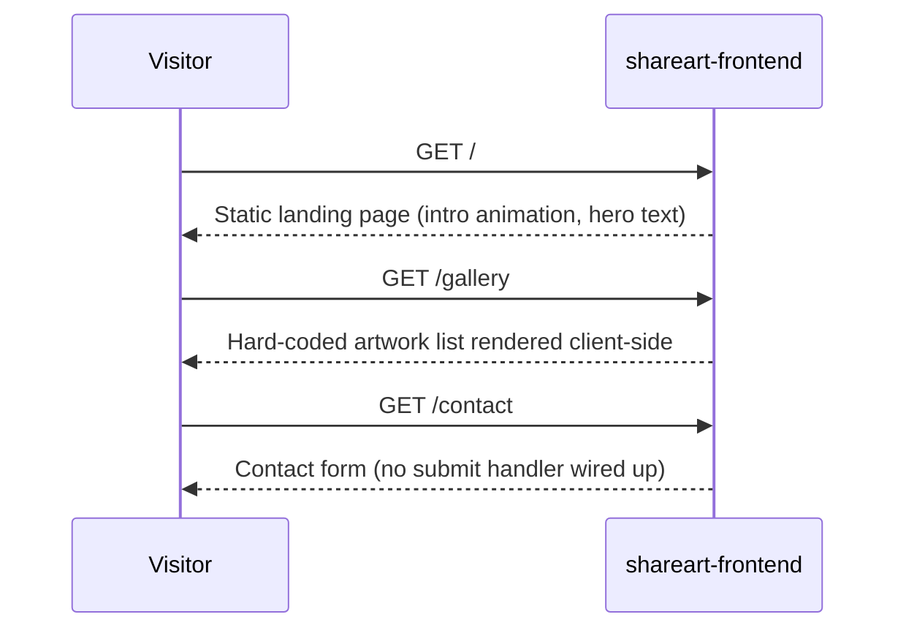

# System Architecture

## System Overview

A single Next.js 15 (App Router, React 19) application (`shareart-frontend`) rendering static/client pages with no server-side data layer. `shareart-backend` exists as a sibling repository but is currently empty (README only) — there is no running backend, API, or database today.

## Architecture Diagram

```mermaid
flowchart TD
    Browser["Browser"] --> Next["shareart-frontend\nNext.js App Router"]
    Next --> Home["/ (Home)"]
    Next --> Gallery["/gallery"]
    Next --> Contact["/contact"]
    Next --> Design["/design (\"Like this website?\")"]
    Next -.->|"not connected"| Backend["shareart-backend\n(empty)"]
```

## Component Descriptions

### shareart-frontend
- **Purpose**: Renders the public portfolio site.
- **Responsibilities**: Routing (App Router `src/app/*`), presentational components, static content.
- **Dependencies**: `next`, `react`, `react-dom`, `framer-motion` (intro animation), `@tanstack/react-router` (present in `package.json` but unused — App Router handles routing instead), Tailwind CSS v4 for styling.
- **Type**: Application (frontend-only, no server logic beyond Next.js defaults).

### shareart-backend
- **Purpose**: Declared but unimplemented backend for AvakianArt.com.
- **Responsibilities**: None yet.
- **Dependencies**: None yet.
- **Type**: Application (empty).

## Data Flow



## Integration Points

- **External APIs**: None.
- **Databases**: None.
- **Third-party Services**: None (Google Fonts via `next/font` for Geist typeface only).

## Infrastructure Components

- **CDK Stacks**: None.
- **Deployment Model**: Not yet configured (no CI/CD, no hosting config found in repo).
- **Networking**: N/A.
