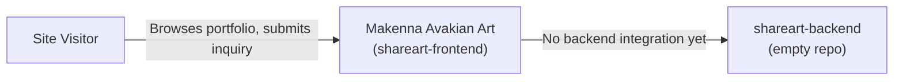

# Business Overview

## Business Context Diagram

## Business Description

- **Business Description**: `shareart-frontend` is currently Makenna Avakian's personal, single-artist portfolio website ("Makenna Avakian Art" / avakianart.com). It presents her artwork, a commission inquiry form, and personal links. It is a static marketing/portfolio site with no user accounts, no payments, and no persistence layer.
- **Business Transactions**: None are actually implemented yet — the "Contact" form renders but has no submit handler (no backend, no email integration). There is no purchase, commission-request, or payment flow implemented.
- **Business Dictionary**:
  - **Artwork/Listing**: A hard-coded piece of art shown on the Gallery page (title, description/medium, image, Available/Sold status).
  - **Commission inquiry**: The (currently non-functional) contact form intended for buyers to reach out about custom work.

## Component Level Business Descriptions

### shareart-frontend (Next.js app)
- **Purpose**: Public-facing personal art portfolio for a single artist (Makenna Avakian).
- **Responsibilities**: Present home/landing page, artwork gallery, contact/commission inquiry form, and a personal links page.

### shareart-backend (empty repo)
- **Purpose**: Declared as "Backend for AvakianArt.com" in its README, but contains no code yet — purpose is not yet realized in the codebase.
- **Responsibilities**: None implemented.
