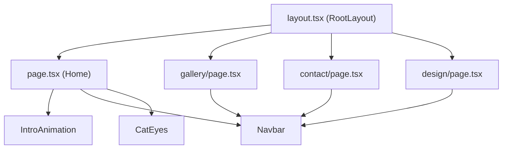

# Code Structure

## Build System

- **Type**: npm, Next.js CLI (`next dev/build/start --turbopack`)
- **Configuration**: `package.json`, `next.config.ts` (empty/default config), `tsconfig.json`, `postcss.config.mjs`, `eslint.config.mjs` (flat config, `next/core-web-vitals` + `next/typescript`), `.prettierrc.json` + `prettier-plugin-tailwindcss`.

## Key Classes/Modules

### Existing Files Inventory

- `src/app/layout.tsx` - Root layout; sets `<html>`/`<body>`, loads Geist fonts, sets page metadata/title.
- `src/app/page.tsx` - Home page: hero text ("Makenna Avakian — Artist & Software Engineer"), renders `IntroAnimation`, `Navbar`, `CatEyes`.
- `src/app/gallery/page.tsx` - Gallery page: renders a hard-coded array of 4 artworks (title, medium, image, Available/Sold status) as a responsive grid.
- `src/app/contact/page.tsx` - Contact page: a form (Name, Email, Message) with no `onSubmit`/action wired up yet — purely presentational.
- `src/app/design/page.tsx` - "Like this website?" page: personal links (LinkedIn, GitHub).
- `src/app/components/Navbar.tsx` - Fixed top navigation bar with links to Gallery, Contact ("Commisions" — note typo), and Design.
- `src/app/components/IntroAnimation.tsx` - Framer Motion intro/splash animation shown on load.
- `src/app/components/CatEyes.tsx` - Whimsical interactive decorative component (cat eyes that presumably track cursor/scroll, per Framer Motion usage).
- `src/app/globals.css` - Global Tailwind styles.
- `src/app/favicon.ico` - Site favicon.
- `public/` - Static assets (referenced image paths like `/watercolor/art1.jpg` are used by the Gallery page but the actual image files were not verified to exist).

## Design Patterns

### App Router file-based routing
- **Location**: `src/app/*`
- **Purpose**: Next.js 15 convention; each folder under `src/app` is a route.
- **Implementation**: Standard Next.js App Router with `"use client"` directives on interactive components (`Navbar`, `design/page.tsx`).

## Critical Dependencies

### next (15.5.4)
- **Version**: 15.5.4
- **Usage**: App framework, routing, image optimization (`next/image`), fonts (`next/font/google`).
- **Purpose**: Core framework.

### react / react-dom (19.1.0)
- **Version**: 19.1.0
- **Usage**: UI rendering.
- **Purpose**: Required peer of Next.js 15.

### framer-motion (^12.23.22)
- **Version**: ^12.23.22
- **Usage**: `IntroAnimation`, `CatEyes` interactive/animated components.
- **Purpose**: Animation library.

### tailwindcss (^4) + @tailwindcss/postcss
- **Version**: v4
- **Usage**: All component styling via utility classes.
- **Purpose**: Styling.

### @tanstack/react-router (^1.132.37)
- **Version**: ^1.132.37
- **Usage**: **Not actually used anywhere in `src/`** — dependency is present in `package.json` but the app relies entirely on Next.js App Router for routing. Likely leftover/unused dependency.
- **Purpose**: N/A currently — candidate for removal unless there's a planned use.
